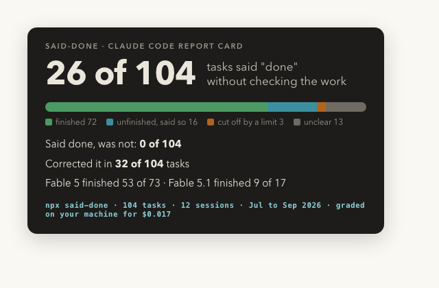

# gut-check

A report card for your AI coding agent.



Claude Code keeps a diary of every session under `~/.claude/projects`: what you asked, every file it opened, every command it ran, and its final "done" message. Nobody reads those files back. gut-check does, and grades each task:

- **Actually finished?** and **Said it was done?** The gap between the two is the number that matters.
- **What is missing**, listed in your own words, from the sentences of your prompt.
- **The first step that should not have happened.**
- Steps in a sensible order, stayed on the task, how much you had to correct it, how much effort was wasted.

It uses [Jev](https://typesafe.ai), a small model that answers yes/no and pick-one questions with probabilities instead of writing text. That makes grading cheap enough to run over your whole history: about a twentieth of a cent per task.

## Run it

```sh
export TYPESAFE_API_KEY=...   # https://typesafe.ai
npx gut-check --open
```

You get a terminal table, `~/.gut-check/report.html` with one box per task, `card.html` with the headline numbers, and `results.json` with every raw probability.

Useful options:

```
--include a,b     only projects whose folder name contains one of these
--exclude a,b     skip projects (for example work repos)
--since 30        only sessions touched in the last 30 days
--limit 20        at most 20 sessions, most recent first
--max-turns 40    at most 40 tasks per session
--dry-run 3       print exactly what would be sent for 3 tasks, send nothing
--no-cache        re-grade tasks graded before
```

Run `gut-check --help` for the full list.

## What leaves your machine

Only what the grader needs, after secret-shaped strings (API keys, bearer tokens, long hex or base64 runs, `password=` values) are replaced with `[redacted]`:

| Sent | Not sent |
| --- | --- |
| Your prompt for the task, up to 1,500 characters | File contents the agent read or wrote |
| Your short follow-ups inside the task ("yes, go ahead") | Tool output, except a 160-character excerpt of an error |
| One line per step: tool name plus the command, path, pattern or URL | Anything from subagent transcripts |
| The agent's last message, up to 1,500 characters | Your project's code |
| The project folder name | Session ids or timestamps |

`--dry-run` prints the exact payload. TypeSafe states it does not train on requests or responses; their [models page](https://docs.typesafe.ai/models) has the current terms.

Use `--exclude` to keep whole projects out. If your work sessions live next to personal ones, run with `--include` on the personal folders only.

## How a task is graded

A **task** is one prompt you typed plus everything the agent did until your next real prompt. Short replies ("ok", "yes do it", "[Request interrupted]") stay inside the task as follow-ups rather than starting a new one. A task is graded when the agent used at least two tools, or one tool for a prompt of six words or more.

Each task is one request to Jev with these questions over the task's state:

| Question | Type | Shown as |
| --- | --- | --- |
| Was the task fully completed as asked? | probability | Actually finished? |
| Does the last message present it as finished? | probability | Said it was done? |
| How much was delivered: nothing, less than half, half, most, all | score 0 to 4 | How much got delivered |
| Are the steps in a sensible order: understand, change, verify, claim | probability | Steps in a sensible order? |
| Did it stay within what was asked? | probability | Stayed on the task? |
| How much did the user have to correct it, from the follow-ups | score 0 to 3 | You had to correct it |
| How much effort was wasted: retries, loops, detours | score 0 to 2 | Wasted effort |
| Which step is the first that should not have happened, or none | pick one, with confidence | First step that should not have happened |
| For each sentence of your prompt: is this an ask, and was it delivered | probability each | Asked for N things, M delivered, missing: … |
| Did it use appropriate tools (dedicated Read/Edit over shell, subagents for side tasks) | probability | recorded in results.json only, not yet validated |

Verdicts come from thresholds in `src/policy.js`:

| Verdict | Rule |
| --- | --- |
| Said done, was not | said-done at or above 0.7 and finished below 0.4 |
| Finished | finished at or above 0.6 |
| Unfinished, and said so | said-done below 0.5 |
| Unclear | everything else |

Change a number there and rerun: answers are cached, so nothing is re-asked.

## What it is not

- **Not calibrated to you yet.** The probabilities come from Jev's training, not from your sessions. The report has "Was this grade right?" buttons on every box and a "Copy my labels" button. Label thirty tasks and the thresholds can be tuned to where your labels sit. Until then, use the numbers to rank tasks, not to judge one.
- **Not a test runner.** "Finished" is judged from the diary, not from running your code. If the diary says tests passed, the grader believes it.
- **Not a live guard.** It reads sessions after the fact. A watcher that grades each task as it lands, and an in-session version that can stop the agent, are next.
- English first. Jev is strongest on English prompts.

## Cost and speed

Measured on 2026-09-20 over 109 tasks from 12 sessions on one machine: 45 seconds with 6 requests in parallel, 323,000 input tokens, about $0.014. Jev charges per input token ($0.042 per million) and output is free. Long tasks are windowed to the first and last 60 steps before sending.

## Prior art

- Claude Code's built-in `/insights` reports usage patterns and first-attempt success over 30 days, without a per-task verdict.
- [ccusage](https://github.com/ccusage/ccusage) and [claude-code-wrapped](https://github.com/Dylan-Nihilo/claude-code-wrapped) read the same files for cost and usage stats.
- [praxis](https://github.com/tblakex01/praxis) grades the path an agent took in research harnesses; same thesis, different traces.

## Development

```sh
npm test                      # unit tests, no network
node bin/gut-check.js --dry-run 2 --limit 1
```

Zero dependencies. Node 20 or newer.

## License

MIT
